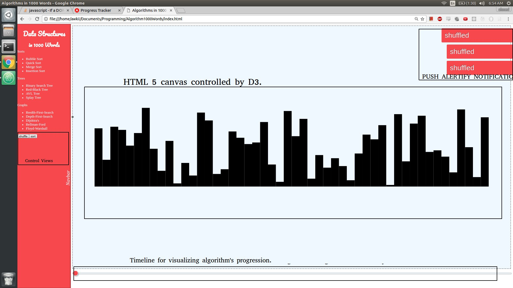
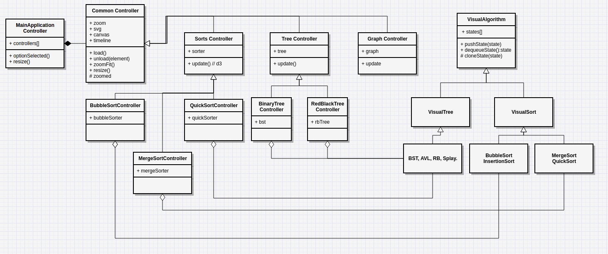

# Algorithms in 1000 Words
**Purpose:** To visually explain a myriad of algorithms through the magic of D3.

**Difficulty Scale:** Not nearly as ambitious as it sounds. We have a well thought-out plan. Please review before you jump to a decision.

**Gottchyas** This is a two-man job. ~~I'm only the best because I work with the best. If you don't trust who you're working with then you're as good as dead. *[TODO: insert more Armageddon quotes here]*~~

### Background:

There are some algorithm visualization tools out there, but, from what I've observed,
they are very specialized and spread apart. Our goal is to create one central
repository that will compare the pros and cons of a multitude of algorithms.

I've taken the liberty of scanning through my old 'Data-Structures and Algorithms'
course syllabus, and compared it to some of those that I found online that belong
to other universities. For the most part, each of those classes roughly teach
the same basic concepts with little variation.

The essential Data-Structures Data-Structures to denote are Lists, Sets, Heaps, Trees, or Graphs. Similarly, there are essential algorithms fall under the categories of Shuffles, Sorts, Searches, Shortest-Paths, and Minimum-Spanning-Graphs.

## Summary

In short there is a lot of ground to cover, The scope of this project is going to span 3 specific categories: Sorts, Binary Trees, and short-path algorithms as a bonus. Ahmed is scheduled to work on BSTs, and Jin has agreed to work on sorts.
This project is half as ambitious if two people are allowed to work on it.

## MVP

These are the concepts that this project (at its best) hopes to convey, visually:
#### Sorts (Jin Chen)
* *Bubble* - An easy-to-implement and easy-to-comprehend sort with O(n^2) runtime
* *Quick* - A very-very fast sort. The gold standard. However, suffers from recursion-complexity in some cases.
* *Insertion* - An okay sort with O(n^2) time complexity. VERY good on almost-sorted lists.
* *Merge* - A very fast sort O(n logn), but on avg not as good as QuickSort. O(N) space complexity is higher than average.
* *Random* - ~~My favorite sort. Say you have a deck. you throw the deck up into the air, collect the cards from the ground, and then check to see if the cards are sorted. If not, then repeat step 1. Has the best best-case out of all sorts.~~

#### Binary Search Trees (Ahmed Elzeiny)
* *(Naive) Binary Tree* - Simple and very basic tree with no self-balancing mechanism. Search complexity can be O(n) when sequential inputs are added.
* *Red-Black Tree* - A self-balancing tree based on Red/Black Nodes.
* *AVL Tree* - An RB-Tree after it hit the gym. Better balancing mechanisms cause slower on insertion/deletion time, faster on search time, and higher space complexity.
* *Splay Trees* - When a node is accessed anywhere on the tree, the entire tree rearranges itself such that the accessed node becomes the root. Subsequent searches for the same item become O(1), but initial access can be O(n)

## Wireframes
* Note that only Bubble Sort and Binary Search Trees are implemented into the demo.
* The Progress Bar at the bottom isn't hooked up to anything at the moment, but will be soon.
* Here's a screenshot of the layout

## Architecture
* Standard MVC-Design with a heavy emphasis on OOP.
* Almost all the architecture is already built out in this repo
* UML-Diagram below. Username: Made in gliffy.com- un:c1811292@mvrht.net, pass: password

## Technologies
***D3*** is a powerful tool used for demonstrating data over time, making it a perfect companion to our project.
* We've already written the basic version of both D3 controllers.
* One Controller is for visualizing trees. The other for visualizing sorts.
* Each action 'type' of algorithm has a controller that can visualize it.

***Bucket.js*** is an algorithm repo for all the algorithms we wish to visualize.
By forking, refactoring, and giving due credit to this repo, the hardest

***Alertify*** Super optional here, but this is for the push notifications that you see on the top-left of the screenshot above.

## Timeline
### Ahmed
**Day 1**
* Hookup slider (view) to the CommonController (controller), and notify the VisualAlgorithm (model) that a change has occurred.
* Refine loose ends of MVC architecture
  * fix all bugs that arise when mounting/unmounting components
  * Clear D3 canvas
  * Disable slider

**Day 2** - Work on D3 BST animations
* polish Naive BST actions
* motion tweening from state-to-state in D3 with linear transitions

**Day 3** - Polish Data-Structures from Bucket JS Repo (note: I've already done most of the refactoring a while back).
* Polish RB Tree (already half-refactored)
* Polish AVL Tree (already half-refactored)
* Polish Splay Tree (already half-refactored)
* **NB:** All D3 Animations that work on the Naive BST should work on all other trees. No copy-pasting or re-inventing the wheel here, we should be absolutely dry.

**Day 4** - Backup Day
* Backup day in case either I or Jin don't meet our MVPs.
* General polish:
  * Node sizes in D3 should adjust to scale.
* BONUS: If I have time, I'll implement a comparision graph with all 4 trees

### Jin

**Day 1** - Familiarize himself with D3 and the MVC Architecture
* To understand the architecture, try to add an input that increases the number of sorted elements

**Day 2** - Ahmed should have hooked up the timeline bar by now.
* Test and Polish D3 state when timeline events occur. Refactor yesterday's work if necessary.
* implement MergeSort and get it working
* To understand D3, make mergesort look good.

**Day 3** - Sound and audio to hear visited bars.
* Implement one more sort. Should barely take any time now.
* Xylophone sound to represent nodes
  * Inspiration: https://codepen.io/gregh/pen/RKVNgB

**Day 4** - CSS Beautification and Mobile-Responsive Design.
* Ensure that navbar is collapsable.
* Font Selection
* Hover effects on navbar items
* CSS transitions when various algorithms are selected.

## Bonus
#### Graphs
* *Dijsktra* - Gold standard of shortest path searches. Can't deal with negative edge weights.
* *Belman-Ford* - A bit slower than Dijsktra's, but can handle negative edge weights.
* *Floyd-Warshall* - Good for finding the shortest paths of all pairs within a graph (no negative cycles). Best used for pre-computational use-cases.
* *A-star* - A brute-force version of Dijsktras using heuristics rather than accurate costs; which can othen lead to quicker results.
